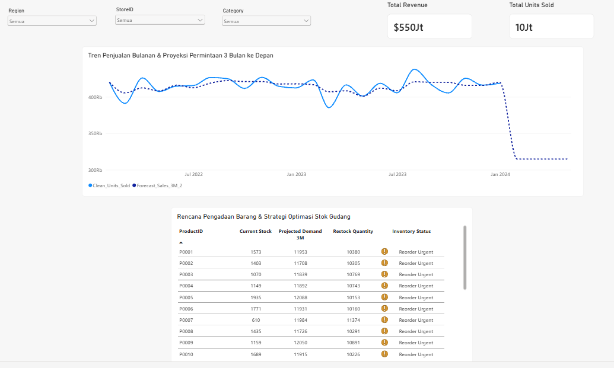

# retail-inventory-forecasting-analysis
Proyek end-to-end data analytics menggunakan MySQL dan Power BI untuk optimasi inventaris ritel. Dengan sistem forecasting permintaan 3 bulan berbasis DAX untuk mencegah risiko kehabisan stok per toko.

# Retail Inventory Optimization & Sales Forecasting Analytics

## 1. Latar Belakang
Proyek ini berfokus pada optimalisasi manajemen persediaan barang (*inventory*). Masalah utama yang diselesaikan dalam proyek ini adalah **meminimalisasi risiko kehabisan stok** yang dapat menghilangkan potensi omset, sekaligus **mencegah penumpukan barang berlebih (overstock)**.

## 2. Pertanyaan Bisnis & Pembatasan Masalah
1. **Tren Permintaan Pasar (Demand Forecasting):** Bagaimana volume penjualan produk untuk 3 bulan ke depan berdasarkan pola pergerakan data historis bulanan?
2. **Risiko Kehabisan Stok (Stockout Risk):** Produk apa saja yang memiliki sisa persediaan fisik (*Current Stock*) kritis dan terancam habis di setiap cabang toko?
3. **Optimasi Stok (Restock Action Plan):** Bagaimana menentukan kuantitas pemesanan ulang (*Restock Quantity*) secara presisi per toko agar operasional tetap aman tanpa memicu *overstock*?

## 3. Arsitektur Data
* **Data Storage & Engineering:** MySQL Workbench
* **Business Intelligence & Analytics Engine:** Power BI Desktop
* **Pola Pemrosesan Data:** Rumus perhitungan untuk Total Revenue menggunakan MySQL, sedangkan beberapa perhitungan lainnya dilakukan menggunakan DAX di Power BI.

## 4. Dashboard Visualisasi

* Executive KPI Cards: Ringkasan performa finansial bisnis (Total Revenue berbasis mata uang) dan total volume komoditas laku (Total Units Sold).
* Location & Category Slicers: Kontrol interaktif penuh berdasarkan parameter Wilayah, Kode Toko, dan Kategori Produk secara real-time.
* Forecast Line Chart: Grafik garis yang mengintegrasikan alur data transaksi masa lalu (garis utuh) dengan jalur ramalan masa depan (garis putus-putus).
* Optimasisation Table: Tabel untuk optimasisasi stok barang.

## 5. Proses Rekayasa Data & Pembersihan (*Data Engineering & Cleansing*)

### A. Penyiapan Database & Impor Data Cepat (MySQL)
Dataset diupload ke MySQL Workbench menggunakan perintah 'LOAD DATA LOCAL INFILE' untuk mempercepat proses karena data yang banyak.

### B. Tahap Pembersihan
* **Pengecekan Nilai NULL:** Mengecek apakah ada nilai NULL / Kosong pada semua kolom.
* **Pembersihan Anomali Angka:** Memastikan data pada kolom kunci (UnitsSold, InventoryLevel, Price) tidak bernilai negatif.
* **Penanganan Duplikasi Data:** Mengecek duplikasi data pada kolom Date, StoreID, dan ProductID.
* **Konsistensi Penulisan:** Mengecek konsistensi penulisan pada kolom Category dan Region.
* **Rentang Tanggal:** Mengecek Rentang Tanggal untuk Forecasting, karena membutuhkan urutan waktu yang konsisten dan memastikan tidak ada lonjakan tahun yang aneh.
* **Penambahan Kolom & Perhitungan:** Membuat kolom tambahan untuk TotalPrice / TotalRevenue di MySQL.

## 6. Pemodelan Data & Rumus DAX (*Data Modeling & DAX*)

### Line Chart (Peramalan / Forecasting Penjualan)

#### 1. Pembuatan Master Kalender Kontinu (Master_Calendar)
Membuat tabel waktu harian untuk memperpanjang sumbu X ke kanan sejauh 3 bulan ke depan melebihi data transaksi terakhir di MySQL.

#### 2. Penyeragaman Tanggal Akhir Bulan (Year_Month_Calendar)
Kolom hitung (*Calculated Column*) pada tabel kalender untuk meringkas urutan harian menjadi skala bulanan tanpa mengubah tipe data *Date*.

#### 3. Penjualan Bersih (Clean_Units_Sold)
Memotong ekor grafik data pada bulan Desember 2023 agar tidak arahnya jatuh tajam ke bawah akibat pemotongan data di awal Januari 2024, karena data januari 2024 tidak lengkap, dan memberikan ruang untuk garis ramalan / forecasting.

#### 4. Peramalan Rata-Rata Bergerak / Moving Average (Forecast_Sales_3M_2)
Menggunakan cara / metode *3-Month Moving Average*. 

### Komponen Tabel Optimisasi Stok Gudang

#### 5. Sisa Stok Terakhir (Current Stock)
Menangkap nominal sisa persediaan fisik riil pada hari penutupan terakhir di gudang, menghindari kesalahan akumulasi kumulatif harian.

#### 6. Forecasting / Proyeksi Kebutuhan Rata-Rata (Projected Demand 3M)
Memproyeksikan total volume kebutuhan produk untuk 3 bulan ke depan. 

#### 7. Kuantitas Aman Untuk Restock (Restock Quantity)
Menghitung defisit jumlah pasokan.

#### 8. Status Inventory (Inventory Status)
Melabeli sesuai keadaan Stok apakah perlu untuk segera order atau aman atau overstock.

## 7. Temuan Kunci Utama & Rekomendasi Bisnis (*Key Insights*)

*   **Tren Untuk Permintaan (*Demand Forecasting*):** 
Line Chart berhasil memperlihatkan tren kestabilan volume penjualan. Sebagai contoh, grafik proyeksi mendatar (*baseline projection*) menunjukkan bahwa rata-rata pergerakan kebutuhan barang berada pada jalur yang konsisten pasca-Desember 2023. Hal ini memberikan kepastian bagi manajemen untuk melakukan perencanaan pengadaan tanpa spekulasi yang fluktuatif.
    
*   **Deteksi Dini Risiko Kehabisan Stok (*Stockout Risk*):** 
Melalui indikator otomatis *"Reorder Urgent"* pada tabel, sistem mendeteksi titik kritis pada beberapa komoditas. Dimana harus segera Reorder barang tersebut untuk memenuhi stok.
    
*   **Rencana Pemesanan Ulang (*Restock Action Plan*):**
Dasbor berhasil mengalkulasi kuantitas pengadaan ulang secara presisi dengan membandingkan sisa stok riil versus akumulasi perkiraan permintaan per toko selama 3 bulan ke depan. Sistem secara otomatis menerbitkan rekomendasi kuantitas pemesanan (*Restock Quantity*).

##  8. Link Dashboard
Visualisasi: [Tautan Portofolio Power BI Service Anda]

## 9. RAW Data
Sumber Data Mentah: [Kaggle - Retail Store Inventory Forecasting Dataset](https://www.kaggle.com/datasets/anirudhchauhan/retail-store-inventory-forecasting-dataset)

#  Author

**AGUSTIANTO**

Indonesia

# LinkedIn
 **LinkedIn:** [Agustianto](https://linkedin.com/in/agus-tianto-a305611a5)
 
# Github
 **GitHub:** [agustianto-lab](https://github.com/agustianto-lab)
